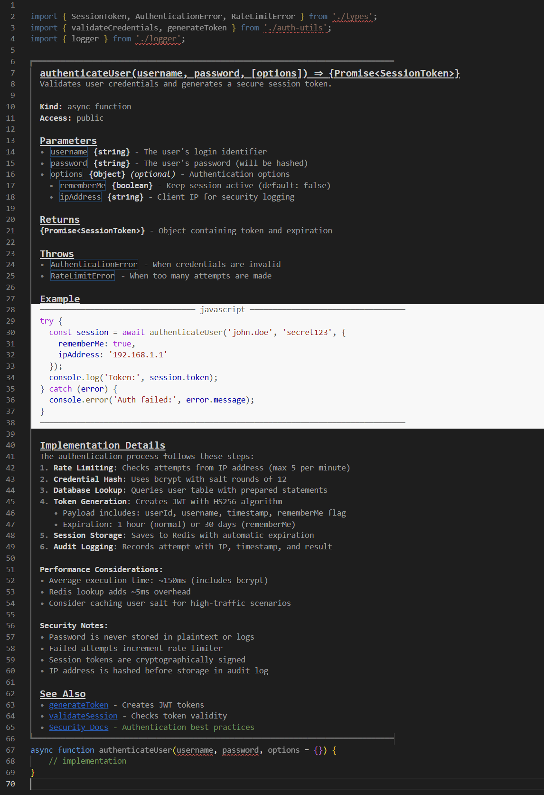
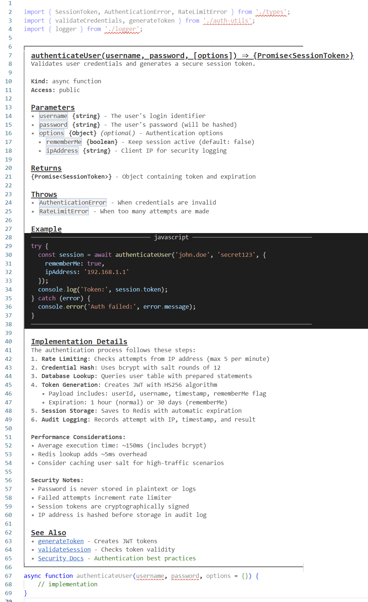

# MD in Comments

A Visual Studio Code extension that renders markdown formatting within comments in code files and markdown files, making documentation in code more readable and visually appealing.

As we do more with AI, markdown documentation is everywhere. Let's make that more readable, and just put the documentation in the code so it's not spread out into multiple locations that need to be kept in sync.

**Your Code Can Look Like This:**


And when you click in the code block, it reverts to code and you can edit it.  Hit `ESC` to get back to the MD view. `Ctrl+Shift+Alt+M` also toggles you in and out of MD view or code.

 * This extension is itself AI generated. I consider myself a good JS programmer, but it would have been a big investment in time to figure out all the VSCode APIs and how to hack them to make it look like MD. That said, the code is AI generated and there may still be bugs.

**I wish that one day VSCode will provide an API to allow an extension to replace a range of code lines, with rendered HTML.** But for now, this extension is doing a lot just by manipulating the decorations on the lines. The limitations are that we can't change the line height, we can't join or separate lines as true MD can, and no images. Still, it's much nicer to read.

## Tips

💡 **Word Wrap**: Use `[View][Word Wrap]` when using this extension so lines wrap at the edge of the window.

## Known Limitations

⚠️ **Indent Guides in Comments**: You may see vertical bars in comment blocks - these are VS Code's built-in indent guides. Unfortunately, VS Code doesn't provide an API for extensions to hide indent guides in specific regions, so they will appear in comments if you have them enabled for your code. This is a VS Code limitation, not an issue with the extension.


## Features

✨ **Markdown Rendering**: Transform plain text into beautifully formatted markdown with support for:

### Block Comments (Multi-line)
Full markdown support in `/* ... */` and `"""..."""` comments:
- **Bold text** using `**text**` syntax
- *Italic text* using `*text*` syntax  
- `Inline code` using backtick syntax
- ~~Strikethrough~~ using `~~text~~` syntax
- Headers (H1-H7) using `#`, `##`, `###`, `####`, `#####`, `######`, `#######` syntax
- Bullet lists with `-` marker
- Numbered lists with `1.`, `2.`, etc.
- Task lists with `- [ ]` (unchecked) and `- [x]` (checked)
- Links with `[text](url)` syntax - displays clickable text with URL in hover
- Images with `` syntax - displays alt text with 🖼️ icon
- Code blocks with ` ```language` syntax and syntax highlighting
- Visual comment block borders with corner decorations
- Automatic 1rem spacing between border and content
- Additional indentation for lists

### Single-Line Comments
Limited markdown support in `//` and `#` comments:
- **Bold**, *italic*, `code`, and ~~strikethrough~~ formatting
- **Links** with `[text](url)` syntax
- Works in standalone comments and trailing comments after code
- **No headers, lists, or code blocks** to keep single lines clean
- Preserves original comment color (no gray overlay)

### Markdown Files
Full markdown rendering in `.md` files with all features enabled.

🎨 **Theme-Aware Styling**: All colors automatically adapt to your VS Code theme:
- **Light Themes**: Dark headers (#1a1a1a to #333333), darker borders, high contrast text
- **Dark Themes**: Light headers (#e0e0e0 to #c0c0c0), lighter borders, comfortable contrast
- **Syntax Highlighting**: Pattern-based colors adapt to light/dark themes
- **Automatic Updates**: Colors refresh instantly when you change themes

**Visual Hierarchy** - Headers distinguished by color intensity and styling:
- H1: 150% size, bold, underlined
- H2: 125% size, bold, underlined
- H3-H7: 100% to 80% size, bold, underlined

�️ **Visual Borders**: Comment blocks are clearly delineated with:
- 2px solid left border (theme-aware color)
- Heavy box-drawing corner characters (┏ and ┗) connecting horizontal and vertical borders
- Consistent border thickness throughout

�📊 **Syntax Highlighting**: Code blocks feature pattern-based syntax highlighting that adapts to your theme:
- Light themes: Colorful syntax highlighting (purple keywords, red strings, etc.)
- Dark themes: White text for maximum readability
- Automatically detects your VS Code theme

✏️ **Smart Edit Mode**: 
- Click on any line in a comment block to switch the **entire block** to raw text for editing
- Press **ESC** while in a comment block to exit text mode and return to rendered markdown
- All other lines stay formatted while you edit

🔧 **Multi-language Support**: Works with popular programming languages including:
- TypeScript/JavaScript
- JSX/TSX (React)
- Python
- Java
- C#
- C/C++
- Go
- Rust
- PHP
- Markdown files

🎛️ **Toggle Control**: Easily enable/disable markdown rendering with keyboard shortcut `Ctrl+Shift+Alt+M` or command palette

🎨 **Enhanced Readability**: Darker text color (#4d4d4d) for better contrast and readability

## Usage

### Block Comments
Write multi-line comments with full markdown support:

```typescript
/*
 * # API Documentation
 * This function handles **user authentication** and returns a *session token*.
 * 
 * ## Parameters
 * - `username`: The user's login name
 * - `password`: The user's password
 * 
 * ### Code Example
 * ```javascript
 * const token = authenticate('user', 'pass');
 * ```
 */
```

### Function Documentation Template

Here is a proposed markdown template for documenting functions - easily convertible to JSDoc. Nothing in this extension requires you to do it this way. It is provided to promote consistency. All things are optional. 

```typescript
/**
 * ## functionName(param1, param2) ⇒ {ReturnType}
 * Brief description of what the function does.
 * 
 * **Kind:** function | method | async function | constructor  
 * **Access:** public | private | protected
 * 
 * ## Parameters
 * - `paramName` **{type}** - Description of the parameter
 *   - `paramName.nestedKey` **{type}** - Description of nested property
 *   - `paramName.anotherKey` **{type}** - Description of another nested property
 * - `optionalParam` **{type}** *(optional)* - Description with default behavior
 * 
 * ## Returns
 * **{returnType}** - Description of return value
 * 
 * ## Throws
 * - `ErrorType` - When this error occurs
 * 
 * ## Example
 * ```javascript
 * const result = functionName(param1, param2);
 * ```
 * 
 * ## Implementation Details
 * Technical description of how the function works internally:
 * 1. **Step One**: What happens first
 * 2. **Step Two**: Next operation with technical details
 * 3. **Step Three**: Final operation
 * 
 * **Performance Considerations:**
 * - Execution time: ~Xms
 * - Memory usage notes
 * - Optimization tips
 * 
 * **Technical Notes:**
 * - Algorithm or data structure used
 * - Important implementation details
 * - Edge cases handled
 * 
 * ## See Also
 * - [Related Function](#) - Brief description
 * - [Documentation](https://example.com) - External reference
 */
function functionName(paramName, optionalParam = null) {
    // implementation
}
```

**Conversion to JSDoc:**
- `## functionName(params) ⇒ {type}` → `@function functionName` with signature
- `**Kind:**` → `@function`, `@method`, `@async`, `@constructor`
- `**Access:**` → `@public`, `@private`, `@protected`
- `## Parameters` section → `@param {type} paramName - description`
- `## Returns` → `@returns {type} description`
- `## Throws` → `@throws {ErrorType} description`
- `## Example` → `@example` with code block
- `## Implementation Details` → `@description` (detailed technical section)
- `## See Also` → `@see` tags


**Real-World Example:**

```typescript
import { SessionToken, AuthenticationError, RateLimitError } from './types';
import { validateCredentials, generateToken } from './auth-utils';
import { logger } from './logger';

/**
 * ## authenticateUser(username, password, [options]) ⇒ {Promise<SessionToken>}
 * Validates user credentials and generates a secure session token.
 * 
 * **Kind:** async function  
 * **Access:** public
 * 
 * ## Parameters
 * - `username` **{string}** - The user's login identifier
 * - `password` **{string}** - The user's password (will be hashed)
 * - `options` **{Object}** *(optional)* - Authentication options
 *   - `rememberMe` **{boolean}** - Keep session active (default: false)
 *   - `ipAddress` **{string}** - Client IP for security logging
 * 
 * ## Returns
 * **{Promise<SessionToken>}** - Object containing token and expiration
 * 
 * ## Throws
 * - `AuthenticationError` - When credentials are invalid
 * - `RateLimitError` - When too many attempts are made
 * 
 * ## Example
 * ```javascript
 * try {
 *   const session = await authenticateUser('john.doe', 'secret123', {
 *     rememberMe: true,
 *     ipAddress: '192.168.1.1'
 *   });
 *   console.log('Token:', session.token);
 * } catch (error) {
 *   console.error('Auth failed:', error.message);
 * }
 * ```
 * 
 * ## Implementation Details
 * The authentication process follows these steps:
 * 1. **Rate Limiting**: Checks attempts from IP address (max 5 per minute)
 * 2. **Credential Hash**: Uses bcrypt with salt rounds of 12
 * 3. **Database Lookup**: Queries user table with prepared statements
 * 4. **Token Generation**: Creates JWT with HS256 algorithm
 *    - Payload includes: userId, username, timestamp, rememberMe flag
 *    - Expiration: 1 hour (normal) or 30 days (rememberMe)
 * 5. **Session Storage**: Saves to Redis with automatic expiration
 * 6. **Audit Logging**: Records attempt with IP, timestamp, and result
 * 
 * **Performance Considerations:**
 * - Average execution time: ~150ms (includes bcrypt)
 * - Redis lookup adds ~5ms overhead
 * - Consider caching user salt for high-traffic scenarios
 * 
 * **Security Notes:**
 * - Password is never stored in plaintext or logs
 * - Failed attempts increment rate limiter
 * - Session tokens are cryptographically signed
 * - IP address is hashed before storage in audit log
 * 
 * ## See Also
 * - [generateToken](#) - Creates JWT tokens
 * - [validateSession](#) - Checks token validity
 * - [Security Docs](https://example.com/security) - Authentication best practices
 */
async function authenticateUser(username, password, options = {}) {
    // implementation
}
```
### Which looks like this in VSCode:


### Single-Line Comments
Use limited markdown formatting in single-line comments:

```typescript
// This is **bold** and *italic* with `code`
const x = 5;  // Trailing comment with **formatting**
```
**Which Look Like This**


The extension automatically detects and renders the markdown formatting. Click on any line to edit the raw markdown.

## Commands

* `MD in Comments: Toggle`: Enable or disable markdown rendering
  - Keyboard shortcut: `Ctrl+Shift+Alt+M` (Windows/Linux) or `Cmd+Shift+Alt+M` (Mac)

* `MD in Comments: Exit Comment Block Text Mode`: Return to markdown rendering from text editing mode
  - Keyboard shortcut: `ESC` (when cursor is inside a comment block)
  - Only works when inside a comment block - doesn't interfere with other ESC key uses

## Supported Markdown Syntax

### ✅ Fully Supported (in block comments)
- **Text Formatting**: Bold (`**text**`), Italic (`*text*`), Strikethrough (`~~text~~`)
- **Code**: Inline code (`` `code` ``), Code blocks with syntax highlighting (` ```language`)
- **Headers**: H1-H7 (`#` through `#######`)
- **Lists**: Unordered (`-`), Ordered (`1.`, `2.`), Task lists (`- [ ]`, `- [x]`)
- **Links**: `[text](url)` - shows text with hover tooltip
- **Images**: `` - shows alt text with icon
- **Horizontal Rules**: Comment delimiters and code block markers rendered as lines

### ⚠️ Limited Support (in single-line comments)
- Only basic text formatting: Bold, Italic, Code, Strikethrough
- No headers, lists, or code blocks

### ❌ Not Supported
- **Tables**: Markdown tables (`| Column | Column |`)
- **Blockquotes**: Quote blocks (`>`)
- **Definition Lists**: Term and definition pairs
- **Footnotes**: `[^1]` style footnotes
- **HTML**: Raw HTML tags
- **Math**: LaTeX/KaTeX equations
- **Emoji Shortcodes**: `:smile:` style (Unicode emoji like 🙂 work)
- **Reference Links**: `[text][ref]` style links
- **Auto-linking**: Plain URLs (must use `[text](url)`)

## Known Issues

- H1 and H2 use larger font sizes (150% and 125%) which may extend beyond line boundaries
- H4-H7 use progressively smaller fonts but may affect line height
- Code block syntax highlighting uses pattern-based coloring (not semantic)
- Complex nested markdown structures may not render perfectly
- Single-line comments don't support headers, lists, or code blocks
- Code blocks inherit VS Code's comment color (typically green) with syntax highlighting overlaid
- Images only show alt text, not actual images (VS Code API limitation)
- Links are not directly clickable in rendered mode (click line to edit, then Ctrl+Click URL)
- ESC key in comment blocks exits text mode - doesn't interfere with autocomplete, find, or other ESC uses

⚠️ **Indent Guides in Comments**: You may see vertical bars in comment blocks - these are VS Code's built-in indent guides. Unfortunately, VS Code doesn't provide an API for extensions to hide indent guides in specific regions, so they will appear in comments if you have them enabled for your code. This is a VS Code limitation, not an issue with the extension.

## Release Notes

### 0.0.7 (Current)

- **Bug Fix**: Fixed double margin issue on lines with hidden asterisk prefixes (e.g., bold text like `**Performance Considerations:**` in JavaDoc-style comments was rendering 2 characters too far right)

### 0.0.6

- **Theme Support**: All colors now automatically adapt to your VS Code theme (light/dark/high contrast)
  - Headers use theme-appropriate colors (dark text for light themes, light text for dark themes)
  - Borders adjust to theme (darker for dark themes, lighter for light themes)
  - Comment text gray scales with theme
  - Syntax highlighting colors match VS Code's default dark theme colors
  - Automatic refresh when theme changes
- **Links in Single-Line Comments**: Added support for `[text](url)` links in `//` and `#` style comments
- **Documentation Updates**: Added function documentation template with JSDoc compatibility
- **Nested Parameters**: Template shows how to document nested object properties

### 0.0.5

- **Visual Borders**: Added 2px solid left border to comment blocks with box-drawing corner characters (┏ and ┗)
- **Block-Level Edit Mode**: Clicking inside a comment block now switches the entire block to text mode for easier editing
- **ESC Key Support**: Press ESC while in a comment block to exit text mode and return to rendered markdown
- **JSX/TSX Support**: Added automatic markdown rendering for React JSX/TSX files
- **All Headers Underlined**: Headers 2-7 now include underlines like H1
- **Improved Spacing**: Fixed spacing consistency for markdown at line start and between border and content
- **Bug Fixes**: 
  - Fixed code blocks in README showing markdown rendering
  - Fixed asterisk-only lines showing bullets
  - Fixed toggle not re-rendering immediately
  - Fixed markdown files not rendering when clicking
  - Removed duplicate vertical bar artifacts

### 0.0.4

- Improved performance: Caching system prevents re-rendering entire document when clicking between lines
- Fixed bold/italic/code text spacing issues with negative letter-spacing on hidden text
- Added support for HTML comments in markdown files (content inside `<!-- -->` is now properly handled)
- Added support for `.github/copilot-instructions.md` files (languageId: 'instructions')
- Fixed document change detection to invalidate cache when content is edited
- Removed unnecessary indentation from pure markdown files (only applies to code comments)
- Header font sizes: H1 at 150%, H2 at 125%

### 0.0.3

- Added keyboard shortcut `Ctrl+Shift+Alt+M` to toggle markdown rendering
- Added support for Headers 4-7 with progressively smaller font sizes
- Added link syntax `[text](url)` with clickable display
- Added image syntax `` with icon and alt text display
- Added task list syntax `- [ ]` and `- [x]` with checkboxes
- Improved text contrast with darker color (#4d4d4d)
- Added 1ch indentation for all content lines
- Added 2ch indentation for list items (bullets, numbers, tasks)
- Fixed rendering for lines starting with markdown syntax
- Improved asterisk prefix hiding (`* ` patterns in comment blocks)

### 0.0.2

- Added markdown file (.md) support
- Added single-line comment support with limited features
- Added trailing comment support (comments after code on same line)
- Added syntax highlighting in code blocks with theme awareness
- Made base colors 20% darker (H1: #1a1a1a, H2: #333333, H3/base: #666666)
- Theme-aware horizontal lines in code blocks
- Fixed edit mode behavior for single-line comments
- Single-line comments preserve original color (no gray overlay)

### 0.0.1

Initial release with markdown rendering support in block comments

**Enjoy beautiful markdown in your code comments!** 🎉
